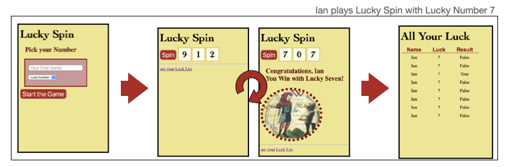

# Exercise
### Experiment with DI in Visual Studio Code

- Fork and clone the repository

- Run the app and verify the services are not working
- Find the Injection point //TODO’s and add necessary code
- Rerun the App to see a complete Luck List with username and Lucky Number

-  *BONUS*:  Swap in a new "CheaterRepository" as the IRepository service that always wins no matter what the Lucky Number

